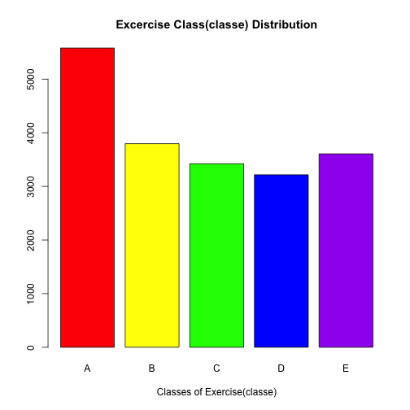
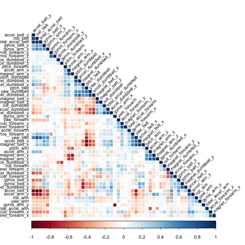
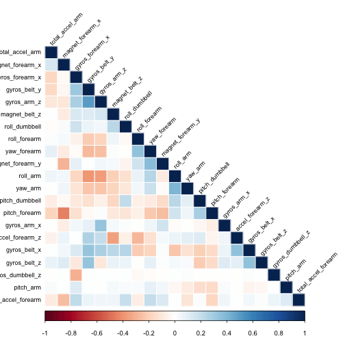

# Practical Machine Learning Course Project - Predicting the Quality of Weight Lifting Exercises

## Background:
The goal of this project is to predict the quality of exercises performed by athletes.  The data for this project come from this source:[http://groupware.les.inf.puc-rio.br/har](http://groupware.les.inf.puc-rio.br/har).  In this study, several athletes were asked to perfrom weight lefting exercises correctly and incorrectly in 5 different ways/classes.  The project provides us two datasets: a [training dataset](https://d396qusza40orc.cloudfront.net/predmachlearn/pml-training.csv) and a [testing dataset](https://d396qusza40orc.cloudfront.net/predmachlearn/pml-testing.csv).  Both datasets contain several predictor variables which we can used to predict the outcome classe which represent the class a given exercise belongs to.  The classe varibale (which is a factor variable with four levels A,B,C,D,E) is present in the training dataset but not in the testing dataset.  Our tasks are:

1. Partition the training dataset into training set and cross-validation set
2. Use the traning set to build a model for predicting the outcome classe and compute the in-sample error
3. Test the trained model on the the cross-validation set and compute the out-of-sample error
4. Use the trained model to predict classe for each of the 20 different test cases in the testing dataset

## Data Loading:
Loading the training dataset and testing dataset into R:

```r
trainingUrl <- "https://d396qusza40orc.cloudfront.net/predmachlearn/pml-training.csv"
testingUrl <- "https://d396qusza40orc.cloudfront.net/predmachlearn/pml-testing.csv"
download.file(trainingUrl, "pml-training.csv",  method="curl")
download.file(testingUrl, "pml-testing.csv",  method="curl")

training <- read.csv("pml-training.csv", na.strings=c("NA",""))
testing <- read.csv("pml-testing.csv", na.strings=c("NA",""))
dim(training); dim(testing)
```

```
## [1] 19622   160
```

```
## [1]  20 160
```

## Data Processing:
### Check for NAs and remove NAs from the training dataset
Training dataset has missing NAs:

```r
sum(is.na(training))  # total NAs in training data
```

```
## [1] 1921600
```

Use str() and see many variables having NAs, so find out which variables have NAs and remove those variables from the training dataset:

```r
varNACounts <- colSums(is.na(training))  # find out which variables have NAs (i.e colSums not equal to 0)
badVars <- varNACounts >= 19000          # set those variables with NAs to TRUE
goodTrainingData <- training[!badVars]   # Remove those variables with NAs from the training data
sum(is.na(goodTrainingData))             # check good training data has no NAs
```

```
## [1] 0
```
Next remove variables that would have no affect on the outcome:

```r
goodTrainingData <- goodTrainingData[,-c(1:7)]
dim(goodTrainingData)
```

```
## [1] 19622    53
```
The good training dataset has the same number of observations as the original training data except now with less variables (53 vesus 160)

### Check for NAs and remove NAs from the testing dataset
Testing dataset has missing NAs:

```r
sum(is.na(testing))  # total NAs in testing data
```

```
## [1] 2000
```
Use str() and see many variables having NAs, so find out which variables have NAs and remove those variables from the testing dataset:

```r
varNACounts <- colSums(is.na(testing))  # find out which variables have NAs (i.e colSums not equal to 0)
badVars <- varNACounts >= 20            # set those variables with NAs to TRUE
goodTestingData <- testing[!badVars]    # Remove those variables with NAs from the testing data
sum(is.na(goodTestingData))             # check good testing data has no NAs
```

```
## [1] 0
```
Next remove variables that would have no affect on the outcome:

```r
goodTestingData <- goodTestingData[,-c(1:7)]
dim(goodTestingData)
```

```
## [1] 20 53
```
The good testing data has the same number of observations as the original testing data except now with less variables (53 vesus 160)

## Exploratory Data Analysis:
Look at summary statistics and distribution of the classe outcome variable:

```r
summary(goodTrainingData$classe)
```

```
##    A    B    C    D    E 
## 5580 3797 3422 3216 3607
```


```r
counts <- table(goodTrainingData$classe)
barplot(counts, col=c("red", "yellow", "green", "blue", "purple"), main = "Excercise Class(classe) Distribution", xlab = "Classes of Exercise(classe)")
```

 

## Training Data Partition:
Partition the good training data into training set (for building model) and cross validation set (for cross validation tesing of the trained model):

```r
library (caret)
```

```
## Loading required package: lattice
## Loading required package: ggplot2
```

```r
inTrain <- createDataPartition(y=goodTrainingData$classe, p=0.6, list=FALSE)
trainingSet <- goodTrainingData[inTrain,]
crossValSet <- goodTrainingData[-inTrain,]
dim(trainingSet)
```

```
## [1] 11776    53
```

## Model Building with the Training Set:
### Remove highly correlated variables from the training set
Since there are many predictor variables in the training set.  To avoid overfitting, it is good idea to remove strongly correlated variables from the tranining set.  Create correlation matrix plot to visualize highly correlated variables:

```r
library(corrplot)
corMat <- cor(trainingSet[,-dim(trainingSet)[2]],)
corrplot(corMat, method = "color", type="lower", order="hclust", tl.cex = 0.75, tl.col="black", tl.srt = 45)
```

 

The correlation matrix plot above shows there are several variables that are strongly correlated (depicted by darker red or blue color).  Remove strongly correlated variables with correlation cutoff = 0.5 from the training dataset:

```r
highlyCorVars <- findCorrelation(corMat, cutoff = 0.5)
newTrainingSet <- trainingSet[,-highlyCorVars]
dim(newTrainingSet)
```

```
## [1] 11776    22
```
Re-plot correlation matrix plot to see if strongly correlated variables are removed:

```r
newCorMat <- cor(newTrainingSet[,-dim(newTrainingSet)[2]])
corrplot(newCorMat, method = "color", type="lower", order="hclust", tl.cex = 0.75, tl.col="black", tl.srt = 45)
```

 

The correlation matrix plot above shows no significant correlation between the variables in the final new training set.

### Build model with the final new training set using the random forests machine learning algorihm with 4-fold cross validation resampling method:    

```r
library(randomForest)
```

```
## randomForest 4.6-10
## Type rfNews() to see new features/changes/bug fixes.
```

```r
library(e1071)
modFit <- train(newTrainingSet$classe ~., data = newTrainingSet, method = "rf", 
                trControl = trainControl(method = "cv", number = 4))
```

```r
print(modFit)
```

```
## Random Forest 
## 
## 11776 samples
##    21 predictor
##     5 classes: 'A', 'B', 'C', 'D', 'E' 
## 
## No pre-processing
## Resampling: Cross-Validated (4 fold) 
## 
## Summary of sample sizes: 8832, 8834, 8830, 8832 
## 
## Resampling results across tuning parameters:
## 
##   mtry  Accuracy  Kappa  Accuracy SD  Kappa SD
##    2    0.972     0.964  0.00355      0.00450 
##   11    0.961     0.951  0.00750      0.00951 
##   21    0.947     0.933  0.00957      0.01212 
## 
## Accuracy was used to select the optimal model using  the largest value.
## The final value used for the model was mtry = 2.
```

### Compute in-sample accuracy:
In-sample accuracy is the prediction accuracy of the trained model on the training set:

```r
trainingPred <- predict(modFit, newTrainingSet)
confusionMatrix(trainingPred, newTrainingSet$classe)
```

```
## Confusion Matrix and Statistics
## 
##           Reference
## Prediction    A    B    C    D    E
##          A 3348    0    0    0    0
##          B    0 2279    0    0    0
##          C    0    0 2054    0    0
##          D    0    0    0 1930    0
##          E    0    0    0    0 2165
## 
## Overall Statistics
##                                      
##                Accuracy : 1          
##                  95% CI : (0.9997, 1)
##     No Information Rate : 0.2843     
##     P-Value [Acc > NIR] : < 2.2e-16  
##                                      
##                   Kappa : 1          
##  Mcnemar's Test P-Value : NA         
## 
## Statistics by Class:
## 
##                      Class: A Class: B Class: C Class: D Class: E
## Sensitivity            1.0000   1.0000   1.0000   1.0000   1.0000
## Specificity            1.0000   1.0000   1.0000   1.0000   1.0000
## Pos Pred Value         1.0000   1.0000   1.0000   1.0000   1.0000
## Neg Pred Value         1.0000   1.0000   1.0000   1.0000   1.0000
## Prevalence             0.2843   0.1935   0.1744   0.1639   0.1838
## Detection Rate         0.2843   0.1935   0.1744   0.1639   0.1838
## Detection Prevalence   0.2843   0.1935   0.1744   0.1639   0.1838
## Balanced Accuracy      1.0000   1.0000   1.0000   1.0000   1.0000
```
The above statistics shows the in-sample accuracy is 1 which is 100%.

## Cross validation with Cross Validation Dataset:
### Tesing the trained model on the cross validation set:

```r
testingPred <- predict(modFit, crossValSet)
```

### Compute out-of-sample accuracy:
Out-of-sample accuracy is the prediction accuracy of the trained model on the cross validation set:

```r
confusionMatrix(testingPred, crossValSet$classe)
```

```
## Confusion Matrix and Statistics
## 
##           Reference
## Prediction    A    B    C    D    E
##          A 2219   23    2    0    0
##          B    7 1480   14    1    2
##          C    1   11 1340   52    3
##          D    3    2   12 1227    6
##          E    2    2    0    6 1431
## 
## Overall Statistics
##                                           
##                Accuracy : 0.981           
##                  95% CI : (0.9777, 0.9839)
##     No Information Rate : 0.2845          
##     P-Value [Acc > NIR] : < 2.2e-16       
##                                           
##                   Kappa : 0.976           
##  Mcnemar's Test P-Value : 5.959e-06       
## 
## Statistics by Class:
## 
##                      Class: A Class: B Class: C Class: D Class: E
## Sensitivity            0.9942   0.9750   0.9795   0.9541   0.9924
## Specificity            0.9955   0.9962   0.9897   0.9965   0.9984
## Pos Pred Value         0.9889   0.9840   0.9524   0.9816   0.9931
## Neg Pred Value         0.9977   0.9940   0.9957   0.9911   0.9983
## Prevalence             0.2845   0.1935   0.1744   0.1639   0.1838
## Detection Rate         0.2828   0.1886   0.1708   0.1564   0.1824
## Detection Prevalence   0.2860   0.1917   0.1793   0.1593   0.1837
## Balanced Accuracy      0.9949   0.9856   0.9846   0.9753   0.9954
```
The above statistics shows the out-of-sample accuracy is 0.986 which is about 98%

## Trained Model Prediction on the Twenty Testing Data:
Now use the trained model to predict classe for each of the 20 different test cases in the testing dataset:

```r
answers <- predict(modFit, goodTestingData)
answers <- as.character(answers)
answers
```

```
##  [1] "B" "A" "B" "A" "A" "E" "D" "B" "A" "A" "B" "C" "B" "A" "E" "E" "A"
## [18] "B" "B" "B"
```

Finally write the answers to the output text files which are used to submit to the [Course Project: Submission](https://class.coursera.org/predmachlearn-007/assignment/index):

```r
pml_write_files = function(x) {
    n = length(x)
    for (i in 1:n) {
        filename = paste0("problem_id_", i, ".txt")
        write.table(x[i], file = filename, quote = FALSE, row.names = FALSE, 
            col.names = FALSE)
    }
}

pml_write_files(answers)
```

## Conclusion:
I have used random forests machine learning algorithm to build a model for predicting the quality of exercises performed by athletes.  My model has an in-sample accuracy of 100% and an out-of-sample accuracy between 98 and 99% (or between 1 and 2% out-of-sample error ). After applying my model to obtain predictions for the 20 different test cases in the testing dataset, I submitted those predictions to the [Course Project: Submission](https://class.coursera.org/predmachlearn-007/assignment/index) and got all of the predictions correctly. 
