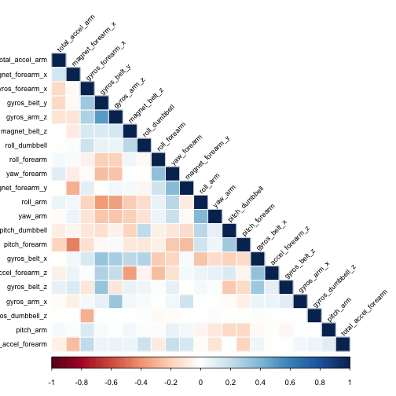

# Practical Machine Learning Course Project - Predicting the Quality of Weight Lifting

## Data Loading:

```r
trainingUrl <- "https://d396qusza40orc.cloudfront.net/predmachlearn/pml-training.csv"
testingUrl <- "https://d396qusza40orc.cloudfront.net/predmachlearn/pml-testing.csv"
download.file(trainingUrl, "pml-training.csv",  method="curl")
download.file(testingUrl, "pml-testing.csv",  method="curl")

training <- read.csv("pml-training.csv", na.strings=c("NA",""))
testing <- read.csv("pml-testing.csv", na.strings=c("NA",""))
dim(training); dim(testing)
```

```
## [1] 19622   160
```

```
## [1]  20 160
```

## Data Processing:
### Check for NAs and remove NAs from the training data
Training data has missing NAs:  

```r
sum(is.na(training))  # total NAs in training data
```

```
## [1] 1921600
```
Use str() and see many variables having NAs, so find out which variables have NAs and remove those variables from training data:

```r
varNACounts <- colSums(is.na(training))  # find out which variables have NAs (i.e colSums not equal to 0)
badVars <- varNACounts >= 19000          # set those variables with NAs to TRUE
goodTrainingData <- training[!badVars]   # Remove those variables with NAs from the training data
sum(is.na(goodTrainingData))             # check good training data has no NAs
```

```
## [1] 0
```
Next remove variables that would have no affect on the outcome:

```r
goodTrainingData <- goodTrainingData[,-c(1:7)]
dim(goodTrainingData)
```

```
## [1] 19622    53
```
The good training data has the same number of observations as the original training data except now with less variables (60 vesus 160)

### Check for NAs and remove NAs from the testing data
Testing data has missing NAs:

```r
sum(is.na(testing))  # total NAs in testing data
```

```
## [1] 2000
```
Use str() and see many variables having NAs, so find out which variables have NAs and remove those variables from testing data:

```r
varNACounts <- colSums(is.na(testing))  # find out which variables have NAs (i.e colSums not equal to 0)
badVars <- varNACounts >= 20            # set those variables with NAs to TRUE
goodTestingData <- testing[!badVars]    # Remove those variables with NAs from the testing data
sum(is.na(goodTestingData))             # check good testing data has no NAs
```

```
## [1] 0
```
Next remove variables that would have no affect on the outcome:

```r
goodTestingData <- goodTestingData[,-c(1:7)]
dim(goodTestingData)
```

```
## [1] 20 53
```
The good testing data has the same number of observations as the original testing data except now with less variables (60 vesus 160)

## Exploratory Data Analysis:

```r
summary(goodTrainingData$classe)
```

```
##    A    B    C    D    E 
## 5580 3797 3422 3216 3607
```


```r
counts <- table(goodTrainingData$classe)
barplot(counts, col=c("red", "yellow", "green", "blue", "purple"), main = "Excercise Class(classe) Distribution", xlab = "Classes of Exercise(classe)")
```

 

## Training Data Partition:
Partition the good training data into training dataset (for building model) and cross validation dataset (for cross validation tesing the trained model)

```r
library (caret)
```

```
## Loading required package: lattice
## Loading required package: ggplot2
```

```r
inTrain <- createDataPartition(y=goodTrainingData$classe, p=0.6, list=FALSE)
trainingSet <- goodTrainingData[inTrain,]
crossValSet <- goodTrainingData[-inTrain,]
dim(trainingSet)
```

```
## [1] 11776    53
```

## Model Building with Training Dataset:
### Remove highly correlated variables from training set
Create correlation matrix plot to visualize highly correlated variables:

```r
library(corrplot)
corMat <- cor(trainingSet[,-dim(trainingSet)[2]],)
corrplot(corMat, method = "color", type="lower", order="hclust", tl.cex = 0.75, tl.col="black", tl.srt = 45)
```

 
Remove highly correlated variable with correlation cutoff = 0.5:

```r
highlyCorVars <- findCorrelation(corMat, cutoff = 0.5)
newTrainingSet <- trainingSet[,-highlyCorVars]
dim(newTrainingSet)
```

```
## [1] 11776    24
```

Re-plot correlation matrix to see if highly correlated variables are removed:

```r
newCorMat <- cor(newTrainingSet[,-dim(newTrainingSet)[2]])
corrplot(newCorMat, method = "color", type="lower", order="hclust", tl.cex = 0.75, tl.col="black", tl.srt = 45)
```

 

### Build model using the random forest method

```r
library(randomForest)
```

```
## randomForest 4.6-10
## Type rfNews() to see new features/changes/bug fixes.
```

```r
library(e1071)
modFit <- train(newTrainingSet$classe ~., data = newTrainingSet, method = "rf", 
                trControl = trainControl(method = "cv", number = 4))
```

```r
print(modFit)
```

```
## Random Forest 
## 
## 11776 samples
##    23 predictor
##     5 classes: 'A', 'B', 'C', 'D', 'E' 
## 
## No pre-processing
## Resampling: Cross-Validated (4 fold) 
## 
## Summary of sample sizes: 8831, 8834, 8832, 8831 
## 
## Resampling results across tuning parameters:
## 
##   mtry  Accuracy  Kappa  Accuracy SD  Kappa SD
##    2    0.974     0.967  0.00316      0.00401 
##   12    0.967     0.959  0.00430      0.00545 
##   23    0.955     0.943  0.00607      0.00770 
## 
## Accuracy was used to select the optimal model using  the largest value.
## The final value used for the model was mtry = 2.
```

### Compute in-sample accuracy

```r
trainingPred <- predict(modFit, newTrainingSet)
confusionMatrix(trainingPred, newTrainingSet$classe)
```

```
## Confusion Matrix and Statistics
## 
##           Reference
## Prediction    A    B    C    D    E
##          A 3348    0    0    0    0
##          B    0 2279    0    0    0
##          C    0    0 2054    0    0
##          D    0    0    0 1930    0
##          E    0    0    0    0 2165
## 
## Overall Statistics
##                                      
##                Accuracy : 1          
##                  95% CI : (0.9997, 1)
##     No Information Rate : 0.2843     
##     P-Value [Acc > NIR] : < 2.2e-16  
##                                      
##                   Kappa : 1          
##  Mcnemar's Test P-Value : NA         
## 
## Statistics by Class:
## 
##                      Class: A Class: B Class: C Class: D Class: E
## Sensitivity            1.0000   1.0000   1.0000   1.0000   1.0000
## Specificity            1.0000   1.0000   1.0000   1.0000   1.0000
## Pos Pred Value         1.0000   1.0000   1.0000   1.0000   1.0000
## Neg Pred Value         1.0000   1.0000   1.0000   1.0000   1.0000
## Prevalence             0.2843   0.1935   0.1744   0.1639   0.1838
## Detection Rate         0.2843   0.1935   0.1744   0.1639   0.1838
## Detection Prevalence   0.2843   0.1935   0.1744   0.1639   0.1838
## Balanced Accuracy      1.0000   1.0000   1.0000   1.0000   1.0000
```

## Cross validation with Testing Dataset:
### Tesing the trained model on the cross validation dataset

```r
testingPred <- predict(modFit, crossValSet)
```

### Compute out-of-sample accuracy:

```r
confusionMatrix(testingPred, crossValSet$classe)
```

```
## Confusion Matrix and Statistics
## 
##           Reference
## Prediction    A    B    C    D    E
##          A 2224   19    2    1    0
##          B    2 1492   16    0    0
##          C    0    4 1342   42    3
##          D    5    0    8 1242    2
##          E    1    3    0    1 1437
## 
## Overall Statistics
##                                           
##                Accuracy : 0.9861          
##                  95% CI : (0.9833, 0.9886)
##     No Information Rate : 0.2845          
##     P-Value [Acc > NIR] : < 2.2e-16       
##                                           
##                   Kappa : 0.9824          
##  Mcnemar's Test P-Value : NA              
## 
## Statistics by Class:
## 
##                      Class: A Class: B Class: C Class: D Class: E
## Sensitivity            0.9964   0.9829   0.9810   0.9658   0.9965
## Specificity            0.9961   0.9972   0.9924   0.9977   0.9992
## Pos Pred Value         0.9902   0.9881   0.9648   0.9881   0.9965
## Neg Pred Value         0.9986   0.9959   0.9960   0.9933   0.9992
## Prevalence             0.2845   0.1935   0.1744   0.1639   0.1838
## Detection Rate         0.2835   0.1902   0.1710   0.1583   0.1832
## Detection Prevalence   0.2863   0.1925   0.1773   0.1602   0.1838
## Balanced Accuracy      0.9962   0.9900   0.9867   0.9817   0.9979
```


## Trained Model Prediction on the Twenty Testing Data:

```r
answers <- predict(modFit, goodTestingData)
answers <- as.character(answers)
answers
```

```
##  [1] "B" "A" "B" "A" "A" "E" "D" "B" "A" "A" "B" "C" "B" "A" "E" "E" "A"
## [18] "B" "B" "B"
```

Write answers to output text files:

```r
pml_write_files = function(x) {
    n = length(x)
    for (i in 1:n) {
        filename = paste0("problem_id_", i, ".txt")
        write.table(x[i], file = filename, quote = FALSE, row.names = FALSE, 
            col.names = FALSE)
    }
}

pml_write_files(answers)
```

## Conclusion:
